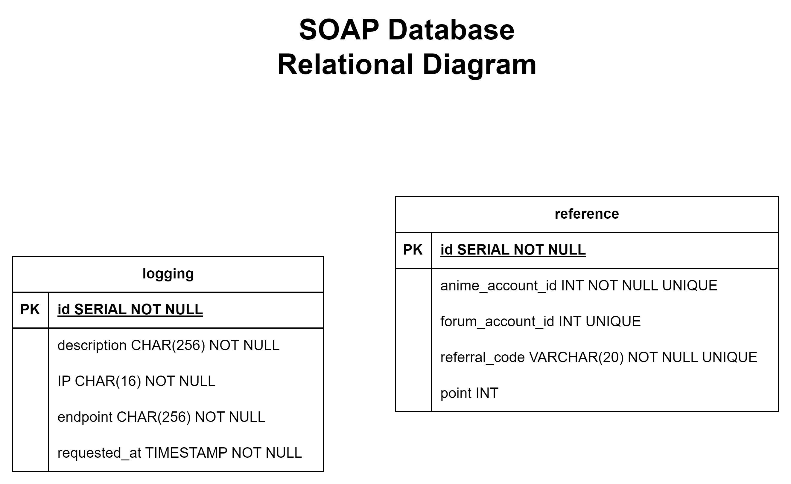

# IF3110 Tugas Besar 2 WBD_SOAP

## *Tubes2_Kelompok 8_SOAP*

## **Table of Contents**
* [Program Description](#program-description)
* [Required Programs](#required-programs)
* [Used Dependencies](#used-dependencies)
* [Database Schema](#database-schema)
* [Endpoints](#endpoints)
* [Execution Guide](#execution-guide)
* [Workload Distribution](#workload-distribution)

## **Program Description**
This repository is used to provide SOAP service for the other repositories. This SOAP service is needed to be a connector between **InfoAnimeMasseForum** that are provided with REST API and the **InfoAnimeMasse** app which is established with PHP.

## **Required Programs**
Here are the requirements needed to run the programs

| Requirements | Reference Link                                                                                  |
|--------------|-------------------------------------------------------------------------------------------------|
| Java |    [Java](https://oracle.com/java/technologies/downloads/) |
| Maven| [Maven](https://maven.apache.org/install.html) |

## **Used Dependencies**
Here are the Dependencies used in the program

| Dependencies           | Reference                                                              |
|------------------------|------------------------------------------------------------------------|
| mysql                  | [mysql](https://mvnrepository.com/artifact/mysql/mysql-connector-java) |
| io.github.cdimascio    | [io.github.cdmascio](https://mvnrepository.com/artifact/io.github.cdimascio) |
| org.mybatis            | [org.mybatis](https://mvnrepository.com/artifact/org.mybatis/mybatis) |
| com.sun.net.httpserver | [com.sun.net.httpserver](https://mvnrepository.com/artifact/com.sun.net.httpserver/http) |
| com.sun.xml.ws         | [com.sun.xml.ws](https://mvnrepository.com/artifact/com.sun.xml.ws) |


## **Database Schema**


## **Endpoints**
The program are launched in url : `http://localhost:8001/ws/reference`
Here are the functions that can be used in this SOAP protocol

| Function                                                  | Description                                                              |
|-----------------------------------------------------------|--------------------------------------------------------------------------|
| insertNewLog(desc)                                        | To insert a new data into logging entity in database                     |
| checkAPIKey()                                             | To check the X-API-Key in the headers when the SOAP protocols are called |
| insertReference(anime_id)                                 | To insert a new reference data with the based of anime_id                |
| insertReferenceMany(many_anime_id)                        | To insert many reference data with several anime_id in a time            |
| updateReferenceEstablishLink(forum_id, ref_code)          | To insert a new link from the forum_id with a referral code              |
| updateReferenceUnlink()                                   | To do an unlink forum account from anime account data                    |
| updateReferenceChangePoint(forum_id, anime_id, numChange) | To change point with both forum_id and anime_id parameter                |
| updateReferenceChangePointWithAnimeId(anime_id, numChange | To change point with anime_id paramater                                  |
| updateReferenceChangePointWithForumId(forum_id, numChange)| To change point with forum_id parameter                                  |
| giveAllReferenceData() | To select all reference data                                             |
| giveAllReferenceDataLimitOffset(limit, offset) | To select all reference data limitedly                                   |
| giveReferenceDataWithAnimeAccountId(anime_id) | To select a specific reference data with anime_id                        |
| giveReferenceDataWithForumAccountId(forum_id) | To select a specific reference data with forum_id |
| deleteReference() | To delete reference data |

## **Execution Guide**
1. Clone this repository with the following command
```
https://gitlab.informatika.org/if3110-2023-01-08/if3110-tugas-besar-2-wbd_rest.git
```
2. Change the working the directory to the cloned directory
3. Use Maven to install the dependencies
```
mvn clean install
```
4. Run the .jar file using java
```
java --add-opens java.base/java.lang=ALL-UNNAMED -cp target/service_soap-jar-with-dependencies.jar com.wbd_soap.App
```
5. The program is launched in url : `http://localhost:8001/ws/reference`


## **Workload Distribution**
| Name                     | Student ID | Fungsionalitas                                                                                                                                                                                                       |
|--------------------------|------------|----------------------------------------------------------------------------------------------------------------------------------------------------------------------------------------------------------------------|
| Irfan                    | 10023176   |                                                                                                                                                                                                                      |
| Bagas Aryo Seto          | 13521081   |                                                                                                                                                                                                                      |
| Juan Christopher Santoso | 13521116   | <ul> <li> Database Implementation <li> Database Model <li> Logging Model <li> Reference Model <li> JaxWS setup <li> All the implementation services for both Logging and Reference <li> API Key Implementation </ul> |

